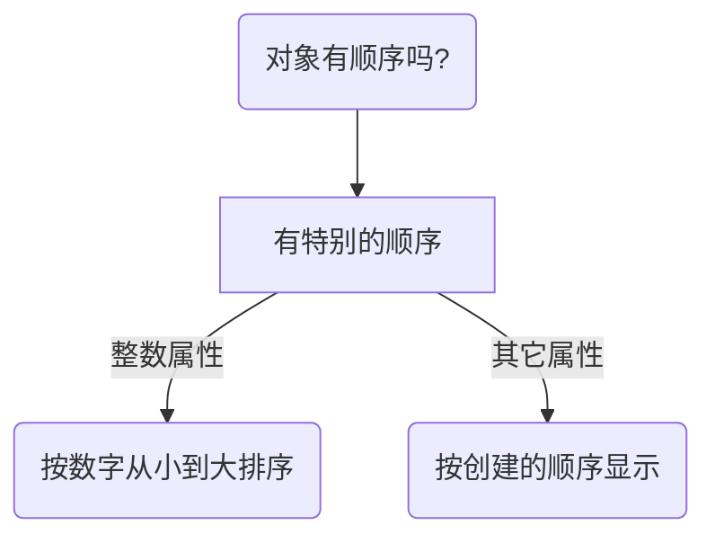

# JavaScript 第三部分

### Object 对象(1~3)

> [https://zh.javascript.info/]: 现代JavaScript教程

[TOC]


#### 1. 对象

* **创建对象**

> 创建对象有两种方式: 
> 1."构造函数" ； 2.“字面量”

```javascript
let even = new Object();
let odd = {};
```

* **对象的增删改**

```javascript
let even = {
	name: 'Jack',
	age: 22,	
}; //创建一个对象
console.log(even.name); //查看对象属性的值
even.sex = "男";		//增加对象的属性
delete even.age;	//删除对象的属性
even.name = "张三"; //修改对象的属性
```

> :zap: 多字词语做属性值，点操作不适用了
>
> ```javascript
> let odd = {
> 	"first name":"Jesson", //多字词语的属性值加引号
> 	age: 27,	
> };
> alert(odd.first name) //语法提示有误
> ```

* **方括号**

> :zap:  除了点操作读取对象属性的值，方括号同样可行并且范围更广
> :heavy_exclamation_mark:    ==点操作不允许从变量中获得键==

```javascript
let even = {
	"first name": "Carter",
	age: 22,
}
console.log(even['first name'], even['age']); //可以读取多字词语的属性值

let key = age;
alert(even[key]); //访问变量
console.log(even.key); //undefined，不允许从变量中获得键
```

> 计算属性
>
> 创建对象可以在字面量中使用方括号

```javascript
let fruit = prompt("Which fruit to buy?", "banana");

let farm = {
	[fruit] : 16,	
}
alert(farm.apple); // 16, 如果fruit == 'apple'
```

* **属性值简写**

> 属性值缩写

```javascript
function farm(fruit, person){
	return {
		name: name,
		age: age,	
    };
}
// 等同于
function farm(fruit, person){
    return{
		name,
		age,
    }
}
```

* **属性名称限制**

> ==属性名称没有限制==，比如可以使用保留字，如：if,else,return...

```javascript
let odd ={
	return: "返回的值",
    if: 5,
    else: 18,
}
console.log(odd.return + odd['if']);
```

* **属性存在性测试，“in”操作符**

> 当输出对象一个不存在的属性值时，控制台会报 undefined
> :exclamation: 当然这是不严谨的，因为若对象存在属性值为 undefined 时，你无法判断该属性​是否存在
> :smiley: ”in“​操作符能解决属性是否存在的问题

```javascript
let farm = {
	apple: "delicious",
    banana: "fresh",
    num: 158,
    pomelo: undefined,
}
console.log(farm.pomelo, farm.orange); //undefined undefined
alert("pomelo" in farm); // true, 属性pomelo存在
```

* **”for...in“ 循环**

> 遍历对象的所有属性

```javascript
let farm = {
	apple: 12,
	banana: 23,
	orange: 56,
	size : {
		width: 100,
		height: 150,
	}
}

for(let key in farm){
    if(typeof farm[key] != "object")
		console.log(key + ":" + farm[key]);
}
```

> 像对象一样排序




#### 2. 对象的引用和复制

* **对象的引用和复制**

  > 一个对象被赋值另一对象,被赋值的对象变量存储的不是对象本身，而是存储的对象**”内存中的地址“**，其实是对另一对象的**”引用“**

  ```javascript
  let message = "life";
  let idea = message; //引用复制
  ```

  ```javascript
  let even = {
  	"first name":"Block",
  }
  let odd = even;
  even["first name"] = "Jennis"; //通过"引用"来修改值
  console.log(odd["first name"]);	//查看变化
  ```

  > 引用复制的流程图

  /JavaScript_object_引用和复制.jpg)

  > 当两个对象为同一对象时，才相等

  ```javascript
  // 两对象为同一对象
  let even = {};
  let odd = even;
  console.log(even == odd, even === odd); //true, true
  //两对象为独立的对象
  let begin = {};
  let end = {};
  console.log(begin == end, begin === end); //false, false
  ```

* **克隆和合并**，**Object.assign**

> 语法： Object.assgin(dest, [src1, src2, src3, ....])
> 第一个参数 `dest` 是指**目标对象**，后面参数 `src1, ... , srcN` 是**源对象**
> 该方法将所有**源对象的属性**拷贝到**目标对象**，调用最后返回 `dest`
>
> :point_right: 如果被拷贝的属性存在，那么将会被覆盖

```javaScript
let natural_number = {
	age: 19,	
}
let even = {"first name": "even",};
let odd = {"last name": "odd"};
Object.assign(natural_number, even, odd);	
// 克隆 得到的是完全独立但有相同的内容
console.log(natural_number["first name"],natural_number["last name"]); //even, odd
even["first name"] = "even_num";
console.log(even["first name"], natural_number["first name"]); //even_num, even 两者不相等
// 克隆的属性相等
console.log(natural_number["last name"] === odd["last name"]); //true
```

> for..in 简单克隆

```javascript
let farm = {
	orange: 17,
	apple: 23,
};
let clone = {};
for(let key in farm){
	clone[key] = farm[key];
}

```

* **深层克隆**

> :bell: 当属性是对另一对象的引用时，那么克隆就会出现==“深拷贝”==的问题。

```javascript
let farm = {
	user: "Finliy",
	size:{
		width: 100,
		height: 150,
	},
};
let clone = Object.assign({}, farm);
console.log(clone.size === farm.size); //true

console.log(++clone.size.width, farm.size.width); //101, 101 两者相等
```


#### 3. 垃圾回收

* **可达性**

  > JavaScript中主要的内存管理概念是**“可达性”**
  >
  > 如果一个值能被一个引用或者引用链从**跟**访问任何其它值，那么该值是可达的。
  >
  > JavaScript有一个被==“垃圾回收器”==的东西在后台运行，监控这所有对象的状态，并回收那些“**不可达的**”

  * **可达：**

/可达性.svg)

```javascript
let user = {
    name: "John",
};
```

* 两个引用

```javascript
let farm = {
	apple: 16,
	orange: 27,
}
let Finly = farm;
farm = null;
for(let key in Finly)
    console.log(Finly[key]); //apple, orange
console.log(farm, Finly); //null, object[apple, orange]
```

/两个引用.svg)

> 几个对象相互引用，但没有外部没有对对象的连接，也可能被认为是不可达的，所以从内存中被删除


