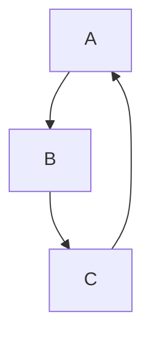
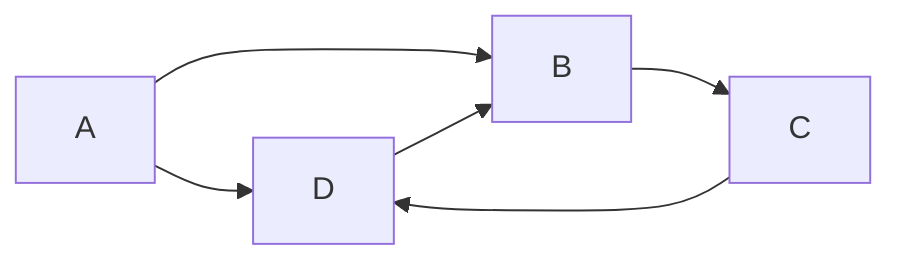
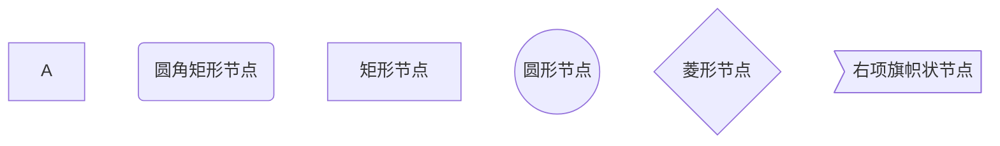
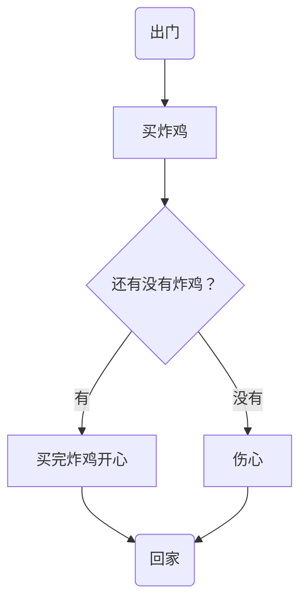
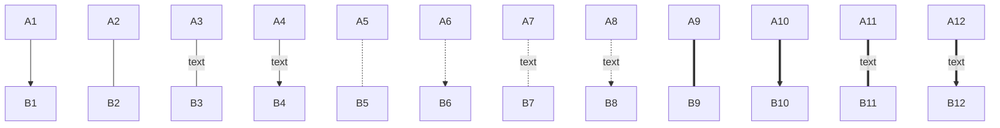
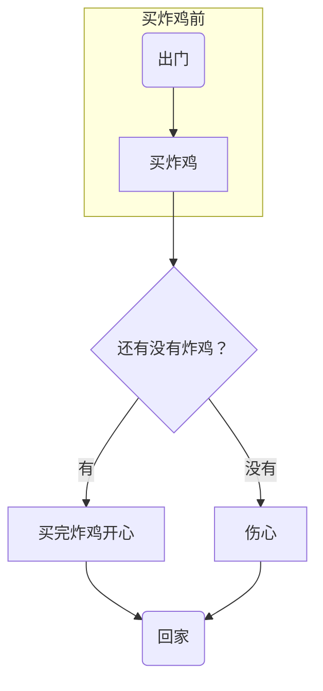
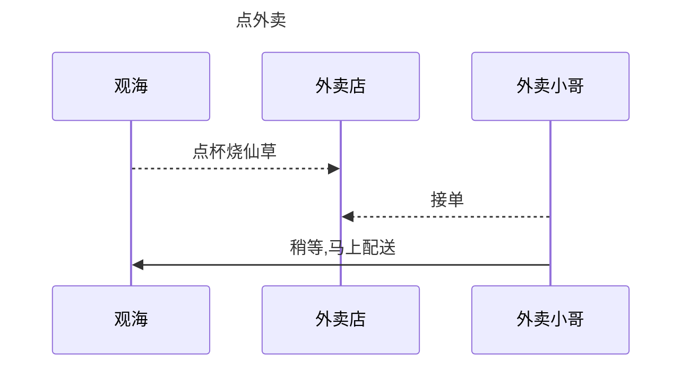

# 基础篇


## 文字特征

* **标题**

> 使用“`# + 空格`”来创建一级标题,根据`#`号的个数至多创建 `1~6级标题` ，例如下面是四级标题

#### 	文字

* **斜体**

> 使用“`* + 文字 + *`”来将文字变为斜体;  :exclamation:**快捷键**：`ctrl + I`

​	*斜体*

* **加粗**

> 使用“`** + 文字 + **`”来将文字变为粗;  :exclamation:**快捷键**：`ctrl + B`

​	**加粗**

* **斜体并加粗**

> 使用“`*** + 文字 + ***`”来将文字变为斜体并加粗;

​	***斜体加粗***

* **下划线**

> 使用“`<u></u>`”来将文字底部添加下划线； :exclamation: **快捷键**： `ctrl + U`

​	<u>下划线</u>

* **删除线**

> 使用“`~~ + 文字 + ~~`”来将文字添加删除线；:exclamation: 快捷键： `ctrl + shift + 5`

​	~~删除线~~

* **高亮**

> 使用“`== + 文字 + ==`”来将文字显示高亮；

​	==高亮==

* **下标**

> 使用“`~ + 文字(一般是数字) + ~`”来将文字下标

​	H~号~

* **上标**

> 使用“`^ + 文字(一般是数字) + ^`”来将文字下标

​	m^2^


## 表情包

> 使用“`:(英文格式)开头 + 表情包名 + :(英文格式)结尾`”，来使用表情包

​	:smile::100::arrow_lower_left::headphones:


## 表格

> 使用“`ctrl + T`”来使用表格

|      |      |      |
| ---- | ---- | ---- |
|      |      |      |
|      |      |      |
|      |      |      |

## 引用

> 使用"`> + 空格`“来显示引用;

> 文明实践中心
>
> > 文明实践所
> >
> > > 文明时间点
> > >
> > > > 志愿者


## 列表

#### 无序列表

> 使用”`* + 空格 + 文字`“就可以形成无序列表

* 哈哈哈

+ 你好呀

#### 有序列表

> 使用”`数字(正整数) + 空格 + 文字`“就可以形成有序列表

1. 张三
2. 李四
3. 王五


## 代码块

> 使用”`ctrl + shift + K`“就可以形成代码块

```java
public static void main()
```

### 代码

> 使用”`ctrl + shift + ·(英文格式)`“就可以把所选区域形成代码

`java`, `python`, `javaScript`


## 跳转

* #### 外部跳转 -- 超链接

> 使用`ctrl + k`来表示跳转

[提示文字](https://typora.io/#download)

* #### 内部跳转 --本文档内部跳转

> `()` 括号内用`# + 标题`可以在文档内部跳转，==只能跳转到标题哦==

[我想跳转](# 文字)

* ####  自动链接

> 使用`<>`包括的URL 或者邮箱地址会被自动转换为超链接

网址：<https://www.baidu.com>
邮箱地址： <http://smart.mail.163.com>


## 图片

* #### 网上的图片

  > 使用 ``来创建图片，第一个方括号内可以填入图片名称，括号内==输入网址==可以贴网上的图片

  

* #### 本地图片

  > 本地图images/片在创建图片后，`()`可以填入==绝对路径==和==相对路径==，推荐使用==**相对路径**==，绝对路径在不同电脑上，图片将无法显示(路径不对):smile:

  

* #### 截图

  > 在剪切板上复制图片到文件，可以贴上图片

  **图片网址**: <https://limestart.cn/>

  


# 画图篇

### 流程图

* ##### 简易流程图

| 用词 |   含义   |
| :--: | :------: |
|  TB  | 从上到下 |
|  BT  | 从下到上 |
|  RL  | 从右到左 |
|  LR  | 从左到右 |


>graph TB;
>	A-->B;
>	B-->C;
>	C-->A;



> graph LR;
> 	A-->D;
> 	A-->B;
> 	D-->B;
> 	B-->C;
> 	C-->D;



* ##### 流程图常用符号及其含义

> graph TB;
> 	A;
> 	B(圆角矩形节点);
> 	C[矩形节点];
> 	D((圆形节点));
> 	E{菱形节点};
> 	F>右项旗帜状节点]



```代码块
graph TB
     begin(出门)--> buy[买炸鸡]
     buy --> IsRemaining{"还有没有炸鸡？"}
     IsRemaining -->|有|happy[买完炸鸡开心]--> goBack(回家)
     IsRemaining --没有--> sad["伤心"]--> goBack
```




```代码块
graph TB
A1-->B1
A2---B2
A3--text---B3
A4--text-->B4
A5-.-B5
A6-.->B6
A7-.text.-B7
A8-.text.->B8
A9 === B9
A10==>B10
A11==text===B11
A12==text==>B12
```




* ##### 子图表

> subgraph 子图表名称
> 			子图表中的描述语句...
> end


```
graph TB
	subgraph 买炸鸡前
   			 begin(出门)--> buy[出门买炸鸡]
    end
    buy --> IsRemaining{"还有没有炸鸡？"}
    IsRemaining --没有--> sad["伤心"]--> goBack(回家)
    IsRemaining -->|有|happy[买完炸鸡开心]--> goBack
```





* ##### 序列图

```代码块
sequenceDiagram 
	[参与者1][消息线][参与者2]:消息体
    ...
```

> sequenceDiagram
> 	Title: 点外卖
> 	观海 -->> 外卖店: 点杯烧仙草
> 	外卖小哥 -->> 外卖店: 接单
> 	外卖小哥 ->> 观海: 稍等,马上配送




